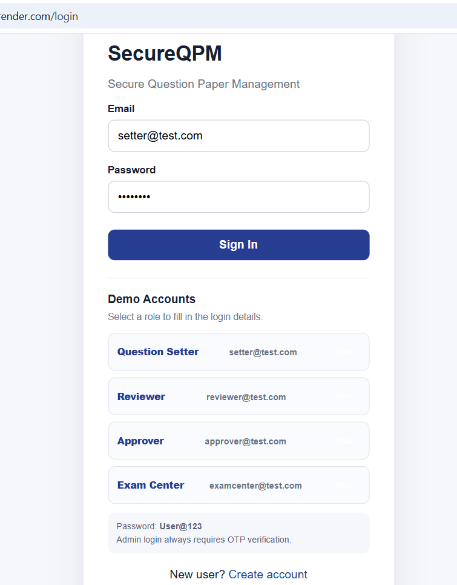
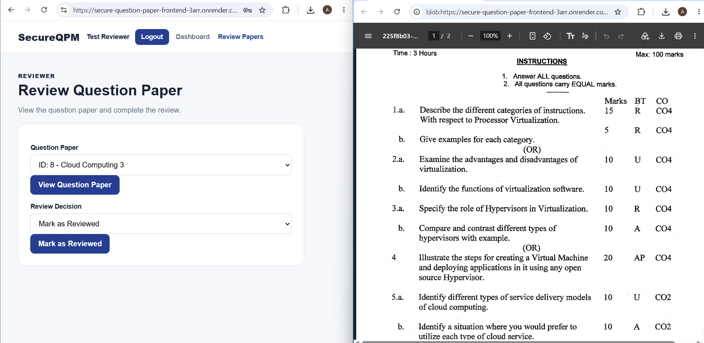
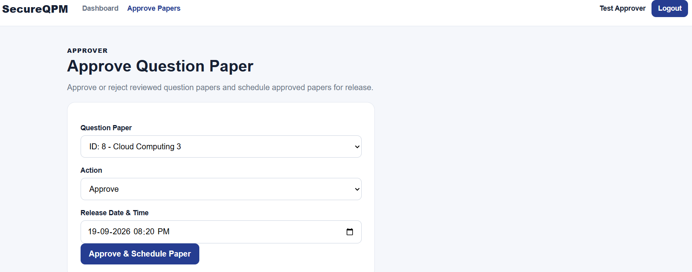

# Secure Management of Competitive Examination Question Papers

## Project Description

The **Secure Management of Competitive Examination Question Papers** system is a secure web-based application designed to manage government competitive examination question papers throughout their lifecycle.

The system controls access to question papers from upload to examination release. Different users are assigned different roles such as Question Setter, Reviewer, Approver, and Exam Center. Authentication, role-based authorization, multi-factor authentication, encryption, integrity verification, audit logging, and scheduled release mechanisms are used to reduce the risk of unauthorized access, modification, and leakage.

The system is designed with a cloud deployment architecture so that the frontend, backend, database, and file storage can be hosted separately and securely.

---

## Technologies and Tools Used

### Frontend

* React.js
* JavaScript
* HTML
* CSS
* Axios
* Vite

### Backend

* Java
* Spring Boot
* Spring Security
* Spring Data JPA
* REST API
* Maven
* JSON Web Token (JWT)

### Database and Storage

* PostgreSQL
* Supabase PostgreSQL Database
* Supabase Private Storage

### Security

* JWT Authentication
* Role-Based Access Control (RBAC)
* Multi-Factor Authentication (MFA)
* OTP
* BCrypt password/OTP hashing
* AES-GCM encryption
* SHA-256 file integrity verification
* HTTPS
* Audit Logging
* Time-based release control

### Development and Deployment Tools

* IntelliJ IDEA
* Visual Studio Code
* Postman
* Git
* GitHub
* Render
* Supabase

---
## Installation and Setup

### Prerequisites

Install the following:

* Java JDK
* Maven
* Node.js and npm
* Git
* A Supabase account

### Clone the Repository

```bash
git clone https://github.com/Aashima0805/secure-question-paper-management.git
cd secure-question-paper-management
```

---

## Backend Setup

Navigate to the backend:

```bash
cd backend
```

Configure the required environment variables:

```text
SUPABASE_URL
SUPABASE_KEY
ENCRYPTION_SECRET_KEY
JWT_SECRET
```

Email configuration is also required for OTP functionality:

```text
MAIL_USERNAME
MAIL_PASSWORD
```

Run the Spring Boot application using:

```bash
mvn spring-boot:run
```

The backend runs on:

```text
http://localhost:8080
```

---

## Frontend Setup

Open another terminal and navigate to:

```bash
cd frontend
```

Install dependencies:

```bash
npm install
```

Create a `.env` file:

```env
VITE_API_BASE_URL=http://localhost:8080/api
```

Start the frontend:

```bash
npm run dev
```

The frontend runs on:

```text
http://localhost:5173
```


## Project Structure

```text
secure-question-paper-management/
│
├── README.md
├── .gitignore
├── screenshots/
│   ├── Login.png
│   ├── Question Setter.png
│   ├── Review.png
│   ├── Approve.png
│   ├── Exam Centre 1.png
│   └── Exam Centre 2.png
├── backend/
│   ├── pom.xml
│   ├── mvnw
│   ├── mvnw.cmd
│   │
│   └── src/
│       ├── main/
│       │   ├── java/
│       │   │   └── com/securequestionpaper/
│       │   │       └── questionpapermanagement/
│       │   │           ├── config/
│       │   │           ├── controller/
│       │   │           ├── dto/
│       │   │           ├── entity/
│       │   │           ├── repository/
│       │   │           ├── service/
│       │   │           └── util/
│       │   │
│       │   └── resources/
│       │       └── application.properties
│       │
│       └── test/
│
└── frontend/
    ├── package.json
    ├── package-lock.json
    ├── .env.example
    │
    └── src/
        ├── components/
        ├── pages/
        ├── App.jsx
        ├── api.js
        ├── auth.js
        ├── main.jsx
        └── styles.css
```

---

## Backend Modules

### Config

Contains security, JWT authentication filter, and CORS configuration.

### Controller

Provides REST API endpoints for users, question papers, administration, and audit logs.

### DTO

Contains request data structures used by authentication and OTP operations.

### Entity

Contains database entities such as User, QuestionPaper, AuditLog, and SecuritySetting.

### Repository

Provides database access using Spring Data JPA.

### Service

Contains business logic for authentication, JWT generation, OTP/MFA, email, Supabase storage, and audit logging.

### Utility

Contains encryption, hashing, and OTP utility functions.

---

## Frontend Modules

### Authentication

Provides registration, login, and OTP verification.

### Dashboard

Displays role-specific information and available actions.

### Question Paper Upload

Allows authorized Question Setters to upload PDF question papers.

### Review

Allows Reviewers to view and review submitted question papers.

### Approval

Allows Approvers to approve or reject reviewed question papers and schedule the question paper release time.

### Download

Allows Exam Centers to download question papers after release.

### Administration

Allows Administrators to manage users, roles, MFA settings, and audit logs.

---

## Sample Input / Output

### 1. User Login

**Input:**
- Email: `setter@test.com`
- Password: `User@123`

**Output:**
- Successful login redirects the user to the dashboard.
- Based on the assigned role, the user can access only the permitted modules.

### 2. Question Paper Upload

**Input:**
- Question Paper Title: `UPSC General Studies`
- PDF File: `question-paper.pdf`

**Output:**
- The PDF is encrypted using AES-GCM.
- A SHA-256 hash is generated for integrity verification.
- The encrypted file is stored in private cloud storage.
- The paper status is set to `PENDING_REVIEW`.

### 3. Question Paper Review

**Input:**
- Reviewer selects and views a pending question paper.
- Decision: `REVIEWED` or `REJECTED`

**Output:**
- `REVIEWED` → paper moves to the approval stage.
- `REJECTED` → paper is rejected and the action is recorded in the audit log.

### 4. Question Paper Approval and Scheduling

**Input:**
- Approver selects a reviewed question paper.
- Decision: `APPROVE`
- Release Date & Time: `Scheduled date and time`

**Output:**
- Paper status becomes `APPROVED`.
- The release time is stored.
- The scheduling action is recorded in the audit log.

### 5. Secure Download

**Input:**
- Exam Center selects an approved question paper.

**Output:**
- Before the scheduled release time → download is denied.
- After the scheduled release time → the encrypted paper is retrieved, decrypted, integrity-verified using SHA-256, and downloaded as a PDF.

## Screenshots

### Login


### Question Setter - Upload Question Paper


### Reviewer - View and Mark as Reviewed


### Approver - Approve Question Paper


### Exam Center - Download Denied Before Release


### Exam Center - Successful Download After Release


## Application Flow / Testing Steps

The application can be tested through the following end-to-end flow:

1. **Register User**

   * Open the application.
   * Register a new user with the required details.
   * Use a valid email address and password.

2. **User Login**

   * Log in using the registered credentials.
   * Slow sign-in may occur because backend is running on Render's free tier
   * Enter the OTP received through email if MFA is enabled.
     > **Note:** Multi-Factor Authentication (MFA) is implemented as a security feature. A toggle is provided in the Admin module to enable or disable MFA for demonstration and testing purposes. When MFA is enabled, users are required to verify their login using the OTP received through email.

   * After successful verification, the user is redirected to the dashboard.

3. **Admin Login**

   * Log in as an Admin.
   * MFA enable / disable.
   * Assign appropriate roles such as **Question Setter, Reviewer, Approver,** or **Exam Center**.
     > **Note:** All newly registered users are assigned the **USER** role by default. The **Admin** can change a user's role to **Question Setter, Reviewer, Approver,** or **Exam Center** based on the required responsibilities.


4. **Question Paper Upload**

   * Log in as a **Question Setter**.
   * Upload the examination question paper as a PDF.
   * The uploaded paper is securely encrypted and stored.
   * The paper status is set to **Pending Review**.

5. **Question Paper Review**

   * Log in as a **Reviewer**.
   * View the submitted question paper.
   * Mark the paper as **Reviewed** or reject it with a rejection reason.

6. **Question Paper Approval**

   * Log in as an **Approver**.
   * Review the paper that has been marked as Reviewed.
   * Approve or reject the question paper.

7. **Schedule Release**

   * For an approved paper, the Approver sets a future release date and time.
   * The paper remains unavailable until the scheduled release time.

8. **Exam Center Access**

   * Log in as an **Exam Center** user.
   * Attempt to download the paper before the scheduled release time.
   * The system blocks access before the release time.

9. **Question Paper Release**

   * After the scheduled release time, the Exam Center can download the question paper.
   * The system verifies the integrity of the paper before providing the download.

10. **Audit Monitoring**

    * Log in as an **Admin**.
    * Open the Audit Log section.
    * Verify the recorded activities such as upload, review, approval, scheduling, and download.
